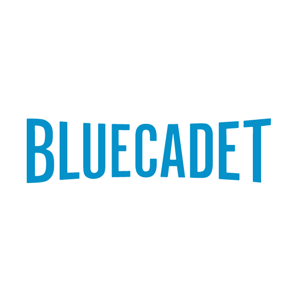
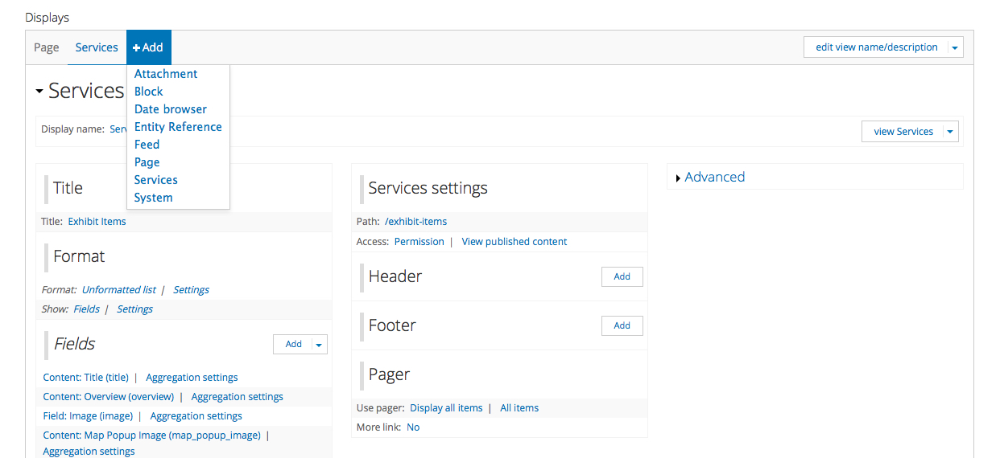
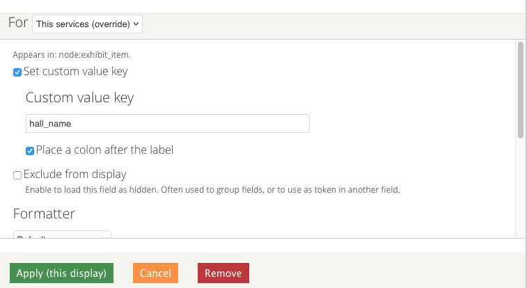
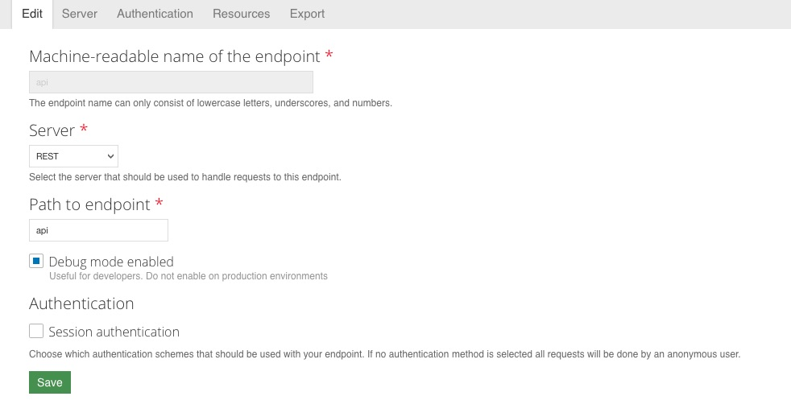
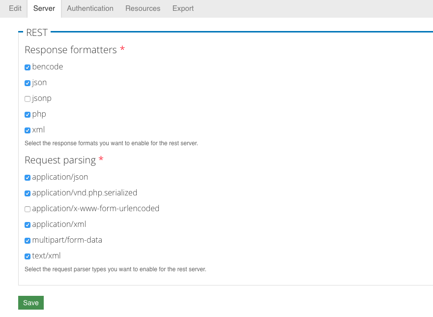
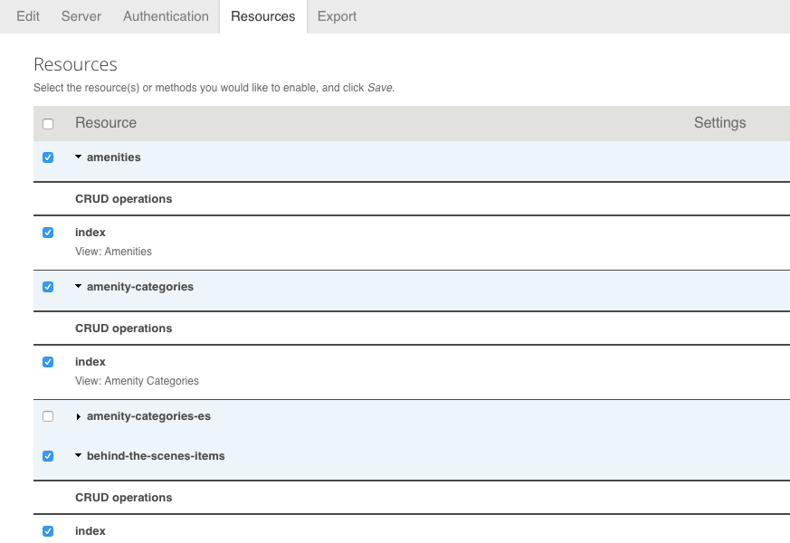
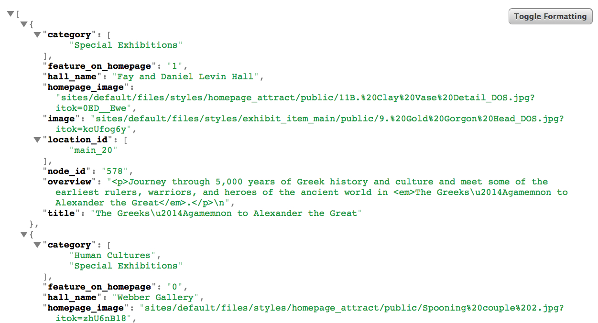
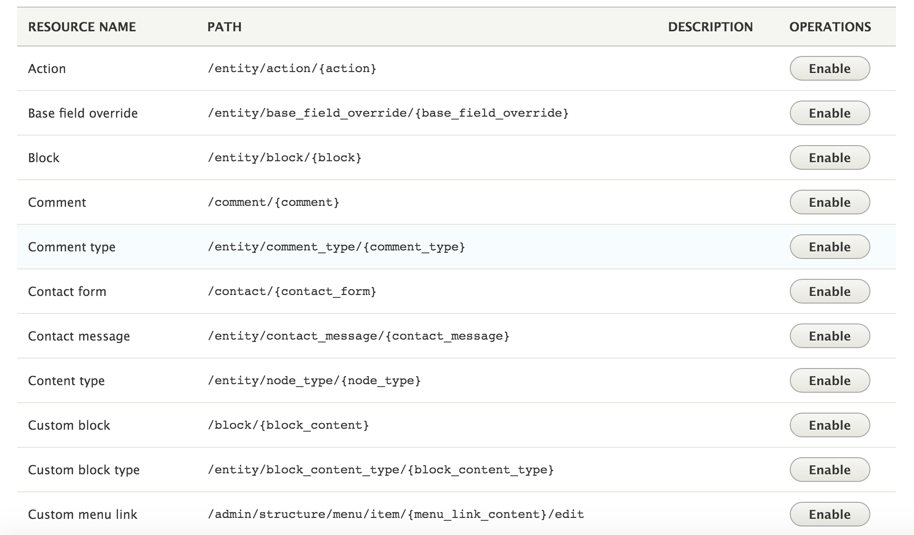
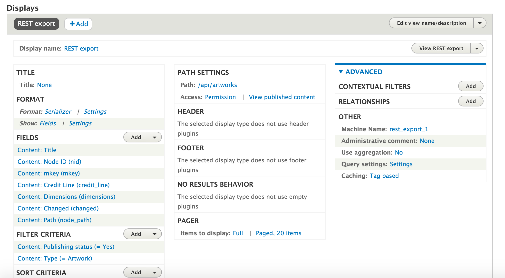

autoscale: true

#### Drupaldelphia 2016
### __*Drupal Beyond the Browser:*__ Using Drupal to Power Apps and Touchscreens

---



* Mark Llobrera - Technology Director @ Bluecadet
* `Twitter: @dirtystylus`

-
* Putra Roeung - Senior Developer @ Bluecadet
* `Twitter: @putrabon`

---


^ Bluecadet is an Emmy Award-winning digital agency that creates world-class websites, mobile apps, interactive installations, and immersive environments.

---

# Outline

* Story Time: How did we get here?
* Case Study: Field Museum
* Case Study: Van Gogh
* Recipe: Drupal 7 + Services
* Drupal 8 Demo

---

# A Story: Content Management the Hard Way


#### [http://bluecadet.com/work/native-american-voices-the-people-here-and-now/](http://bluecadet.com/work/native-american-voices-the-people-here-and-now/)

^ Artifacts—images, video, audio

^ Profiles of prominent Native American leaders

^ 15-foot touch towers

^ 12 kiosk touchscreens corresponding to artifact cases

---

# A Story: Content Management the Hard Way

* Native American Voices exhibit at the Penn Museum
* Hundreds of artifacts (~400)
* Content management with static XML and local files

---


#### *[littlepawz.tumblr.com](http://littlepawz.tumblr.com/post/113859078234/lifes-oh-sht-moment-44)*

---

> XML is not meant to be hand-authored. It’s an output artifact.
-- A smarter person than me

---

# [fit] Pain = Signal

---

# Connecting the Dots

* Web stuff over here, lots of CMS/website builds
* Applications over there (iOS, Android, Cinder)

---

# Start Small

* We built a CMS using something that rhymes with “bird dress”
* JSON, not XML
* Preprocessing, not “live”

---

# Case Study: Field Museum


David Thompson [(https://www.flickr.com/photos/39023889@N00/52377145)](https://www.flickr.com/photos/39023889@N00/52377145)

---

# Case Study: Field Museum

* Digital Orientation Screens for finding out information on Exhibits, Events, Amenities
* Twelve 55" screens throughout the Museum
* Client team was familiar with Drupal, so we looked into what we could do with Drupal

---


[https://vimeo.com/160897482](https://vimeo.com/160897482)

---

# Case Study: Field Museum

* Drupal 7, Services module plus Services Views
* Screens needed to download content locally. Used bash scripts to rsync JSON and images from server to local network.

---

## Case Study: Field Museum
### Custom module to “mark” feeds that needed updating

* **TODO**: try nodejs
* App only wanted to sync JSON data/images for new content
* Services Views could create output for the last created/modified node of each type
* **BUT**: Deleting a node would not be reflected

---

## Case Study: Field Museum
### Custom module to “mark” feeds that needed updating

* `hook_node_presave()`
* `hook_node_delete()`
* `hook_taxonomy_term_presave()`
* `hook_taxonomy_term_delete()`

---

### Case Study: Field Museum
#### Custom module to “mark” feeds that needed updating

```
function field_dos_feed_status_node_presave($node) {
  switch ($node->type) {
    case 'amenity':
      variable_set('amenities_timestamp', time());
      break;
    case 'behind_scenes_item':
      variable_set('behind_scenes_items_timestamp', time());
      break;  
    case 'collection_highlight':
      variable_set('collection_highlights_timestamp', time());
      break;
    …
    default:
      break;
  }
}
```

---

### Case Study: Field Museum
#### Custom module to “mark” feeds that needed updating

```
function field_dos_feed_status_menu_object() {
    $feeds = array(
      array('amenities' => variable_get('amenities_timestamp', '')),
      array('amenity-categories' => variable_get('amenity_categories_timestamp', '')),
      array('behind-the-scenes-items' => variable_get('behind_scenes_items_timestamp', '')),
      …
      array('touchscreen-stations' => variable_get('touchscreen_stations_timestamp', '')),
    );
    return $feeds;
}
```

---

### Case Study: Field Museum
#### Custom module to “mark” feeds that needed updating

```json
[
	{"amenities":1449786054},
	{"amenity-categories":1450716038},
	{"behind-the-scenes-items":1449606828},
	{"collection-highlights":1449607778},
	{"exhibit-items":1451915487},
	{"itineraries":1449608094},
	{"locations":1451915570},
	{"schedule":1454972584},
	{"touchscreen-stations":1439735864}
]
```

---

# Case Study: Field Museum
### Front End

* AngularJS (wait but I thought you said no browsers)
* [TweenMax (http://greensock.com/tweenmax)](http://greensock.com/tweenmax)

---

# Case Study: Field Museum
### Front End


^ Maybe we should have called this “Beyond the website”.

---

# Case Study: Field Museum
### Front End

* Single touch
* Typography in Cinder is still…developing

^ So what are some benefits of using JavaScript over something like Cinder/Unity for a touchscreen application?

---

# [fit] Case Study: :ear: :art:

---

# Case Study: Van Gogh’s Bedrooms

* Installation bringing three versions of Van Gogh’s bedroom together
* Projection / touchscreen

---


#### [https://vimeo.com/155694123](https://vimeo.com/155694123)

---

# Case Study: Van Gogh’s Bedrooms

* CMS originally in WordPress for initial build, client standardized on Drupal so we rebuilt the CMS
* Drupal 7, Services and Services Views to provide JSON
* Cinder (C++) ([https://www.libcinder.org](https://www.libcinder.org)) application

---

# D7 Recipe

* D7: Install Services module and Services Views
*  Drupalize.me series: [https://drupalize.me/videos/introduction-building-services-drupal-7-series?p=1487](https://drupalize.me/videos/introduction-building-services-drupal-7-series?p=1487)

---

# D7 Recipe

### Create a View with a Services Display



---

# D7 Recipe

### Add fields, assign value keys



---

# D7 Recipe

### Configure Service



---

# D7 Recipe

### Select response formats



---

# D7 Recipe

### Select resources (Your View)




---

# D7 Recipe

### Output



---


## Drupal 8

^ It’s finally here!
^ One of the Drupal 8 initiatives that really excites me is Web Services.
^ So for this particular portion of the talk, I'm going to showcase some of the available features in D8 core and attempt to implement some working examples.

---

# So what do we get out of the box?

- REST: RESTful Web Services
- Serialization
- HAL: Hypertext Application Language
- HTTP Basic Authentication

^ This module exposes entities and other resources as a RESTful web API.
^ It provides a service for serialization of data to and from formats such as JSON and XML.
^ It serializes entities using Hypertext Application Language.
^ This module faciliates the use of an username and password for authentication when making calls to the REST API.

---

## __*3 ways*__ to create a REST API with Drupal 8

---

- Option: #1 - __*Using Drupal 8 core Rest Resources*__

- Option: #2 - __*Using View REST exports*__

- Option: #3 - __*Create custom REST endpoint*__

---

##Option: #1 - __*Using Drupal 8 core Rest Resources*__



---

#Demo
### __*Option #1*__

^ In this particular demo, we're going to ultize D8's core RESTful service to return data from a node.

---

# Pros
* Straight out of the box
* Requires almost no setup
* No custom code necessary

# Cons
* Absolutely no flexibility
* Lacks ability to set custom parameters
* Unable to limit output

---

## Option: #2 - __*Using View REST exports*__

^ As many of you already know, the Views module was added to Drupal 8 Core. With RESTful Web Services also in Core, we now have all the tools we need to create highly customizable solutions out of the box.



---

#Demo
### __*Option #2*__

^ In this quick demo, I will show you how to create a view that returns a list of content in JSON via the REST API.

---

# Pros
* It's straight out of the box
* Most developers are familiar with Views
* Manage your configs within the UI

# Cons
* More flexibility, but still limited in various areas
* No ways to set custom parameters
* Authentication issues

---

##Option: #3 - __*Create custom REST endpoint*__

```php

class DBLogResource extends ResourceBase {

  /**
   * Responds to GET requests.   
   */
  public function get($id = NULL) {
    if ($id) {
      $record = db_query("SELECT * FROM {watchdog} WHERE wid = :wid", array(':wid' => $id))
        ->fetchAssoc();
      if (!empty($record)) {
        return new ResourceResponse($record);
      }

      throw new NotFoundHttpException(t('Log entry with ID @id was not found', array('@id' => $id)));
    }

    throw new BadRequestHttpException(t('No log entry ID was provided'));
  }
} 

```

^ Being object-oriented by nature, D8 allows us to extend the base Resource Base class and create our own custom resources.

^ With a custom module we can add plugins that can define new REST Resources. For instance, you can return a collection of the data from several nodes or custom data received through database query.


---

# Pros
* Provides most flexibility
* Transformable output (Special Entities)
* Easier to manage versions

# Cons
* Requires reasonable programming knowledge

---

# Power of Decoupled Architectures

* Backend focuses on just having a good content model
* Easier to upgrade front and backends separately
* (Multiple) frontends can change. Prototype in one language, build in another
* If you’re already using Drupal, the barrier to entry is low
* Use the endpoints for any devices
* Makes frontend work fun again!

^ Just going back to Mark's point eariler. With the Van Gogh project, we were able to switch rebuilt the content on another CMS without having to change our front end code.

---


* Mark Llobrera - Technology Director @ Bluecadet
* `Twitter: @dirtystylus`

-
* Putra Roeung - Senior Developer @ Bluecadet
* `Twitter: @putrabon`

---

## Github

* [https://github.com/dirtystylus/drupaldelphia-2016](https://github.com/dirtystylus/drupaldelphia-2016)